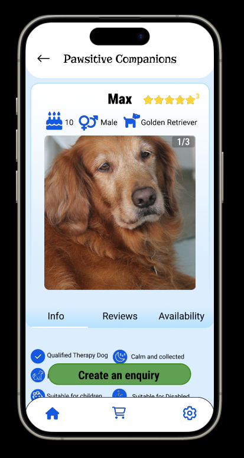
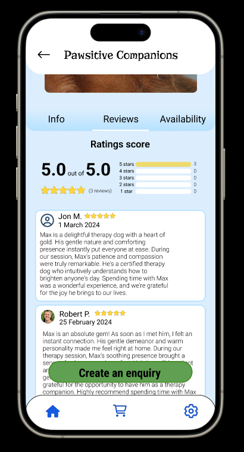
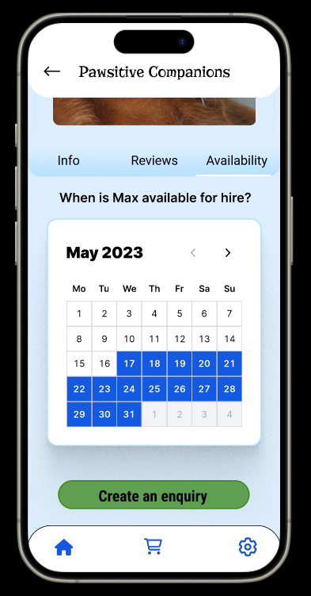
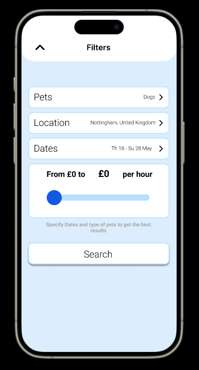
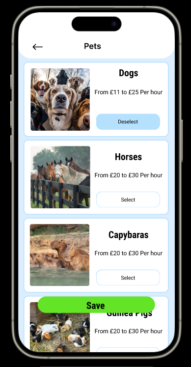
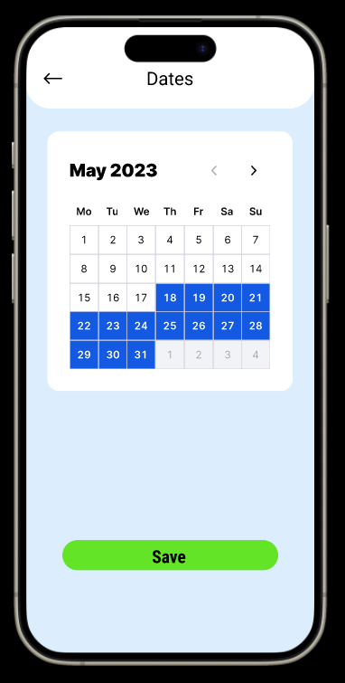
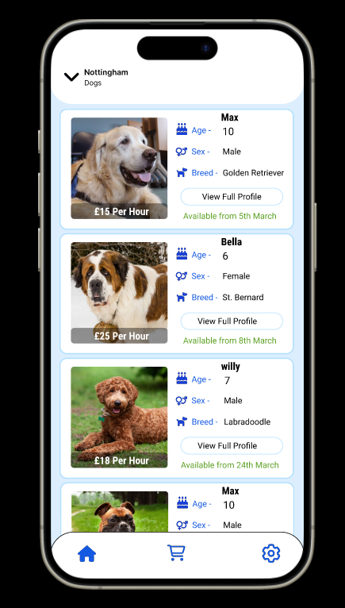
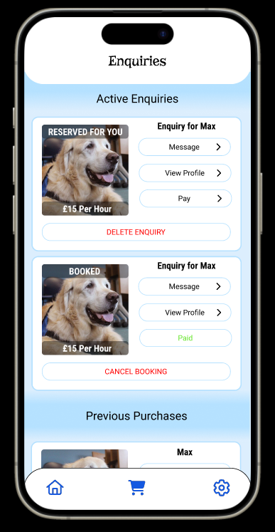
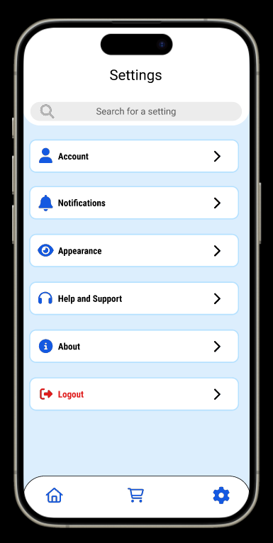

# Dog-Sitting App Prototype

A high-fidelity Figma prototype for a dog-sitting mobile app

## Overview

This prototype focuses on intuitive interaction design, accessibility, and user-centered layout. Core features include browsing sitters, filtering by preferences, and viewing sitter profiles; all designed to support seamless, trustworthy booking experiences for pet owners.

[View Figma Prototype] https://www.figma.com/proto/gt6NCbJmt4BonKkWXCAyvX/Prototype-%7C-HCI?node-id=0-1&t=WBGYZ1V64uM7ipXF-1

## Screenshots

<table>
    <td align="center" colspan="3"><b>Pet Profile</b></td>
  </tr>
  <tr>
    <td></td>
    <td></td>
    <td></td>
  </tr>
  <tr>
    <td align="center" colspan="3"><b>Filter Flow</b></td>
  </tr>
  <tr>
    <td></td>
    <td></td>
    <td></td>
  </tr>
    <td align="center" colspan="3"><b>Navigation</b></td>
    <tr>
    <td></td>
    <td></td>
    <td></td>
  </tr>
</table>

## Tools Used

- **Figma** – UI/UX Design
- **UX Research** – User personas, usability testing, and design iteration
- **Accessibility Design** – High contrast, clear navigation, and inclusive interaction patterns

## Notes

- Created for the University of Nottingham’s Human-Computer Interaction module — graded 79%.
- Designed using Gestalt principles, colour psychology, and feedback from usability tests.
